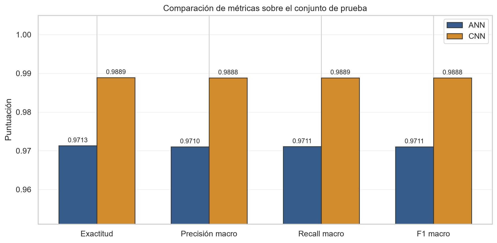
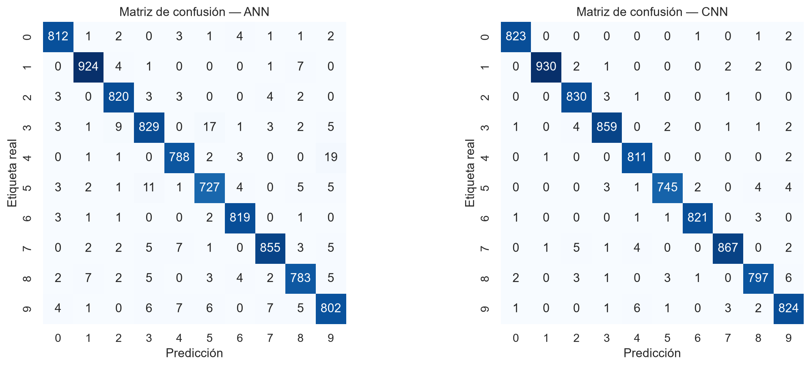

# Laboratorio No. 4 — Clasificación de dígitos MNIST

Proyecto del curso **Text Mining & Image Recognition** que compara una red neuronal artificial (ANN) y una red neuronal convolucional (CNN) para clasificar imágenes de dígitos manuscritos del 0 al 9.

La solución fue desarrollada en Python con TensorFlow/Keras y sigue las guías proporcionadas en las clases, especialmente las instrucciones del Laboratorio No. 4 incluidas en `transcript clase 05.docx`.

## Objetivo

Implementar y evaluar dos enfoques de clasificación multiclase sobre el dataset MNIST:

- Una **red neuronal artificial (ANN)**, que trabaja con cada imagen convertida en un vector de 784 píxeles.
- Una **red neuronal convolucional (CNN)**, que conserva la estructura espacial de la imagen y aprende características mediante convoluciones.

Ambos modelos se entrenan y evalúan con la misma división de datos para realizar una comparación justa.

## Dataset

El archivo `train.csv` contiene:

- 42,000 imágenes en escala de grises.
- Una columna `label` con el dígito correcto, entre 0 y 9.
- 784 columnas (`pixel0` a `pixel783`) con intensidades entre 0 y 255.
- Imágenes originales de 28 × 28 píxeles.

Cada fila se normaliza al rango `[0,1]` y se reconstruye mediante `reshape` como una imagen de dimensión `28×28×1`.

Para respetar la diferencia indicada en las guías:

- La CNN recibe directamente las imágenes `28×28×1`.
- La ANN utiliza una capa `Flatten` para convertir cada imagen en un vector de 784 valores antes de las capas densas.

## Metodología

La división de datos se realizó de forma estratificada y reproducible:

- Entrenamiento: 33,600 imágenes (80%).
- Prueba: 8,400 imágenes (20%).
- Semilla aleatoria: 42.
- Validación interna: 10% de la porción de entrenamiento.

Configuración común:

- Optimizador Adam.
- Pérdida `sparse_categorical_crossentropy`.
- Salida `Softmax` con 10 neuronas.
- Tamaño de lote de 128.
- Máximo de 10 épocas.
- Parada temprana y restauración de los mejores pesos.

### Red neuronal artificial

```text
Entrada 28×28×1
    ↓
Flatten
    ↓
Dense(128, ReLU)
    ↓
Dropout(0.20)
    ↓
Dense(64, ReLU)
    ↓
Dropout(0.20)
    ↓
Dense(10, Softmax)
```

### Red neuronal convolucional

```text
Entrada 28×28×1
    ↓
Conv2D(32, 3×3, ReLU)
    ↓
MaxPooling2D(2×2)
    ↓
Conv2D(64, 3×3, ReLU)
    ↓
MaxPooling2D(2×2)
    ↓
Flatten
    ↓
Dense(128, ReLU)
    ↓
Dropout(0.30)
    ↓
Dense(10, Softmax)
```

## Resultados

Métricas calculadas sobre las mismas 8,400 imágenes de prueba:

| Modelo | Exactitud | Precisión macro | Recall macro | F1 macro | Pérdida logarítmica | Errores | Entrenamiento |
|---|---:|---:|---:|---:|---:|---:|---:|
| ANN | 97.13% | 97.10% | 97.11% | 97.11% | 0.0971 | 241 | 5.17 s |
| **CNN** | **98.89%** | **98.88%** | **98.89%** | **98.88%** | **0.0407** | **93** | 81.75 s |



La CNN obtuvo una ventaja de 1.78 puntos porcentuales en F1 macro y redujo los errores de clasificación en 61.4% respecto de la ANN.

## Matrices de confusión



La mayor concentración de observaciones en la diagonal de la matriz de la CNN muestra una clasificación más consistente entre las diez clases.

## Conclusión

La **CNN es el enfoque seleccionado** porque obtuvo la mayor exactitud, el mejor F1 macro y la menor pérdida logarítmica. Su ventaja se explica por la capacidad de conservar la geometría de las imágenes y aprender patrones locales como bordes, trazos y combinaciones espaciales.

La ANN sigue siendo una alternativa rápida y sólida, pero pierde información espacial al aplanar los píxeles. La CNN requiere más parámetros y tiempo de entrenamiento, aunque ofrece una mejora significativa en la calidad de clasificación.

## Estructura del proyecto

```text
Laboratorio 4/
├── Laboratorio_4_MNIST_ANN_vs_CNN.ipynb  # Solución ejecutada y comentada
├── Reporte_Laboratorio_4.pdf             # Reporte académico de dos páginas
├── reporte_laboratorio_4.html            # Fuente reproducible del reporte
├── train.csv                              # Dataset de entrenamiento
├── requirements.txt                      # Versiones de las dependencias
├── resultados_metricas.csv               # Tabla comparativa de resultados
├── resultados_resumen.json               # Resumen estructurado de resultados
├── comparacion_metricas.png               # Gráfica comparativa
├── curvas_aprendizaje.png                 # Curvas de entrenamiento y validación
└── matrices_confusion.png                 # Matrices de confusión
```

## Requisitos

- Python 3.12
- TensorFlow/Keras
- pandas
- NumPy
- scikit-learn
- Matplotlib
- Seaborn
- Jupyter

Las versiones exactas utilizadas están registradas en [`requirements.txt`](requirements.txt).

## Ejecución

1. Clonar el repositorio y entrar en la carpeta del laboratorio:

   ```bash
   git clone <URL-DEL-REPOSITORIO>
   cd "Repositorio GIT Text Mining RF/Laboratorio 4"
   ```

2. Verificar que `train.csv` esté en la misma carpeta que el notebook.

3. Instalar las dependencias únicamente si no están disponibles en el entorno de Python:

   ```bash
   python -m pip install -r requirements.txt
   ```

4. Abrir el notebook en Visual Studio Code o Jupyter:

   ```bash
   jupyter notebook Laboratorio_4_MNIST_ANN_vs_CNN.ipynb
   ```

5. Ejecutar las celdas en orden, desde el inicio hasta el final.

El notebook entregado ya contiene todas las celdas ejecutadas y sus resultados.

## Reproducibilidad y limitaciones

- Se utilizó una semilla fija para la división de datos y TensorFlow.
- Los tiempos reportados corresponden a una ejecución local sobre CPU y pueden variar según el equipo.
- Los resultados provienen de una sola división estratificada de entrenamiento y prueba.
- No se realizó una búsqueda exhaustiva de hiperparámetros.
- Para una aplicación real se recomienda validar el modelo con imágenes externas y distintas condiciones de escritura.

## Entregables

- [Notebook ejecutado](Laboratorio_4_MNIST_ANN_vs_CNN.ipynb)
- [Reporte académico](Reporte_Laboratorio_4.pdf)
- [Resultados detallados](resultados_metricas.csv)

